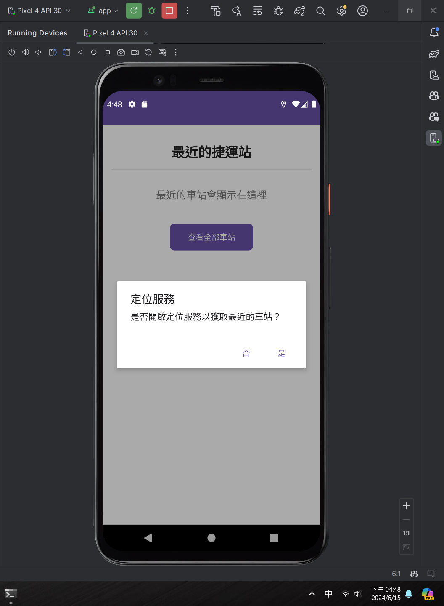
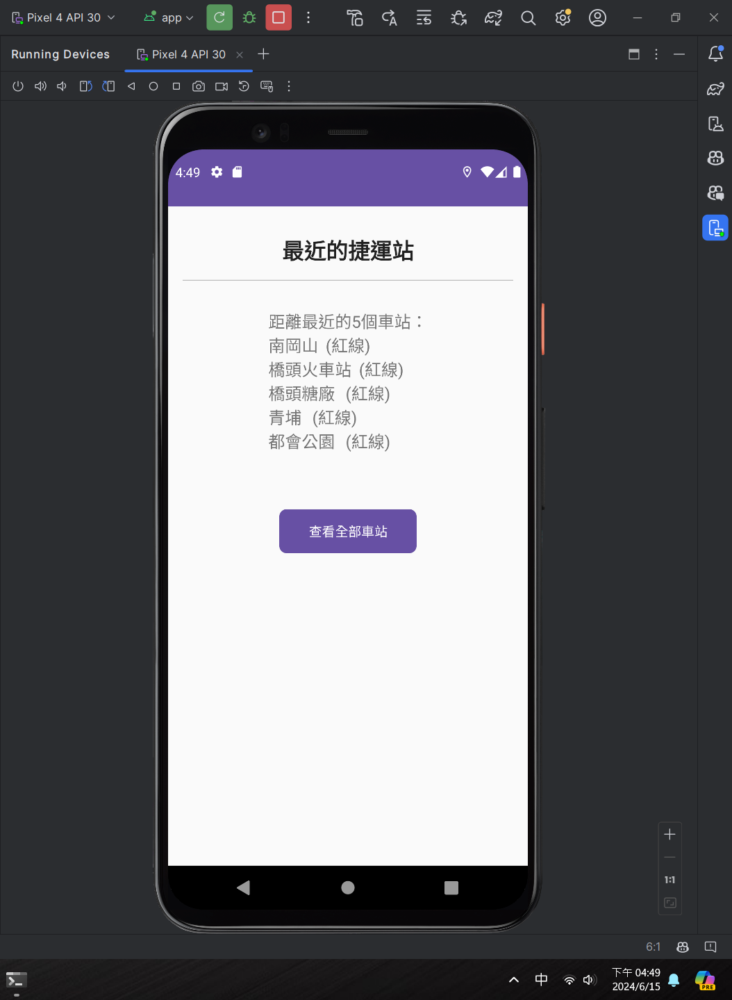
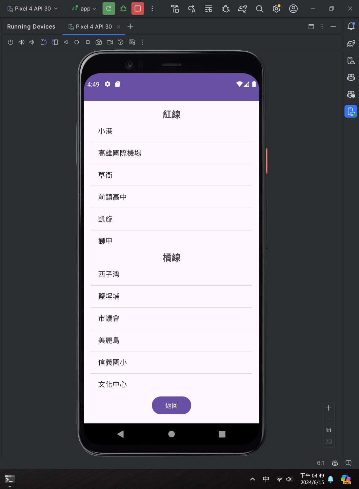

# 111b15086_final2-master

這是一個使用 Android Studio 創建的 Android 項目。該項目包括基於 GPS 位置或手動輸入地址查找最近車站的功能。

## 目錄
- [安裝](#安裝)
- [使用](#使用)
- [功能](#功能)
- [許可證](#許可證)
- [截圖](#截圖)

## 安裝

1. 將倉庫克隆到本地機器：

   ```bash
   git clone git@github.com:1l11l/111b15086_final2-master.git
   ```

2. 在 Android Studio 中打開項目：

   - 啟動 Android Studio。
   - 選擇 `Open an existing Android Studio project`。
   - 導航到克隆的倉庫並選擇它。

3. 構建項目：

   - 確保您已安裝必要的 SDK。
   - 與 Gradle 文件同步項目。

## 使用

1. **運行應用**：

   - 通過 USB 連接您的 Android 設備或啟動模擬器。
   - 在 Android Studio 中點擊 `Run` 按鈕。

2. **查找最近的車站**：

   - 應用啟動時會請求定位權限。
   - 如果授予權限，它將使用 GPS 查找最近的車站。
   - 如果拒絕權限，您可以手動輸入地址來查找最近的車站。

## 功能

- **GPS 定位**：自動使用 GPS 查找最近的車站。
- **手動地址輸入**：手動輸入地址來查找最近的車站。
- **查看所有車站**：按線路（紅線和橘線）分類查看所有車站列表。

## 許可證

此項目根據 MIT 許可證許可 - 詳見 [LICENSE](LICENSE) 文件。

## 截圖

下圖展示了應用程序的主要界面：

### 定位服務提示


### 最近的捷運站顯示


### 查找全部車站


### 請求重新定位

